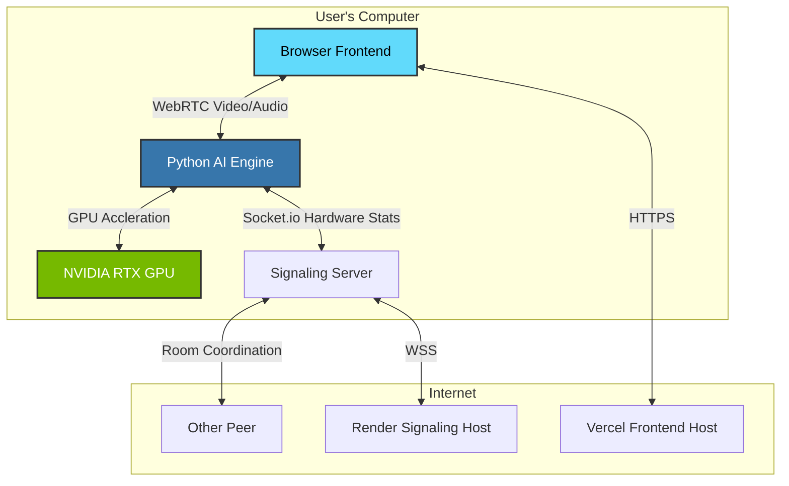

# LumenRTC 🚀

LumenRTC is a peer-to-peer video calling application that leverages local GPU hardware for real-time video enhancement. It utilizes a Python backend for media processing and a React frontend for the user interface.

## System Architecture

## Setup Instructions

### Prerequisites
- Python 3.8+
- Node.js 16+
- NVIDIA GPU (Recommended) Optional 

### Installation
1. Install Python Dependencies:
   `pip install -r requirements.txt`

2. Install Frontend Dependencies:
   `cd client-web`
   `npm install`

3. Install Signaling Server Dependencies:
   `cd ../signaling`
   `npm install`

### Running the Application
You can use the automated script:
`./start_app.cmd`

Or run services manually in separate terminals:
1. Signaling: `node signaling/server.js`
2. Backend: `python python_src/main.py`
3. Frontend: `cd client-web && npm run dev`

### Building Standalone Executable
To package the application as a single `.exe` file:
1. Ensure all dependencies are installed.
2. Run the build script:
   `python build_exe.py`
3. The executable will be created in the `dist/` folder as `LumenRTC.exe`.

## Deployment Guide

### Option A: Split (Recommended for Performance)
- **Frontend**: Vercel
- **Signaling**: Render

### Option B: All-in-One (Simpler)
You can deploy **everything** on Render.

#### 1. Signaling Server (Web Service)
1. New -> Web Service -> Connect Repo.
2. Root Directory: `signaling`
3. Build Command: `npm install`
4. Start Command: `node server.js`
5. Deploy. **Copy the URL**.

#### 2. Frontend (Static Site)
1. New -> Static Site -> Connect Repo.
2. Root Directory: `client-web`
3. Build Command: `npm install && npm run build`
4. Publish Directory: `dist`
5. Add Environment Variable: `VITE_SIGNALING_URL` = [Your Signaling URL from Step 1]
6. Deploy.

### 3. AI Engine (User PC)
- Users download the `.exe` from GitHub Releases.
- Run it locally to enable GPU acceleration.

### 3. AI Engine (User PC)
- Users download the `.exe` from GitHub Releases.
- Run it locally to enable GPU acceleration.
